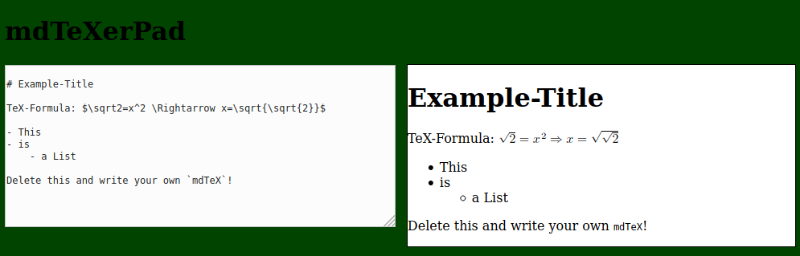

# mdTeXerPad
Multi-User live-rendering Editor for Markdown with included LaTeX-Formulas

## What is this?

## How to use this

### The native local way

- clone the repository or download this
- make sure you have `python3-markdown` and `python3-websockets` installed
- Run the `mdTeXerPad.py`
- point your Browser to `localhost:8081` and start to mdTeXing!
    - mdTeXerPad will also be available from your local network, you can change this by setting `onlyLocal = True` in the `mdTeXerPad.py`!

### The Docker way

- clone the repository or download this
- run `docker-compose up -d`
- point your browser to port `8081` of your docker-host, i.e. `127.0.0.1:8081`

### Getting it to the web

I recommend using a reverse proxy like nginx, you need to make sure that port `8081` (http) and `8082` (ws) is available.

You can then have nginx limit access, encrypt the traffic etc.

## Limitations

This is intended for small use only!

- There is **just one Pad** to work on
- the code is definately **not optimized for fast execution**
- it is developed **only for Firefox** (uses MathML for LaTeX-Formulas)

If you need it bigger feel free to fork and change this or commit a pull-request.
